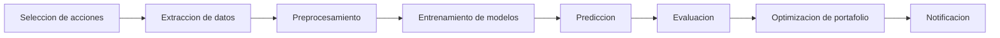
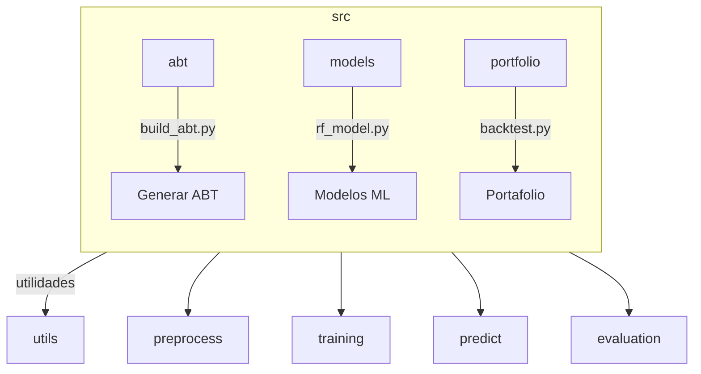
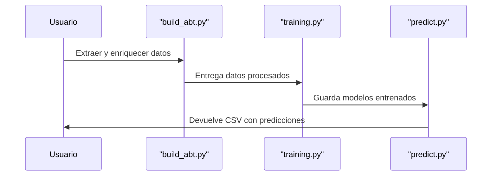
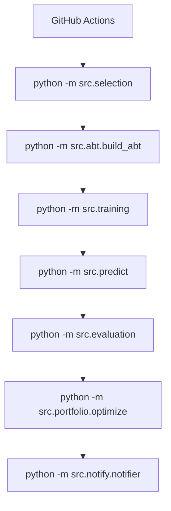

# Yahoo Finance Pipeline

¡Bienvenido a este pequeño experimento! Aquí encontrarás un pipeline educativo que procesa datos de Yahoo Finance de principio a fin. Cada fase está separada en módulos para que puedas revisarla, jugar con ella y adaptarla a tu antojo. No necesitas ser un gurú de Python; basta con seguir las instrucciones y ver qué pasa.

El recorrido va desde elegir los tickers hasta entrenar modelos y armar un portafolio. Para rematar, incluye un ejemplo de notificación final.

## Diagrama general



Puedes lanzarlo a mano o dejar que GitHub Actions lo haga por ti.

## Instalacion

1. Usa Python 3.11 o superior.
2. Instala las dependencias con:

```bash
pip install -r requirements.txt
```

## Configuracion rapida

El archivo `config.yaml` define los ETFs que se procesaran y otras opciones basicas:

```yaml
etfs:
  - SPY
  - QQQ
start_date: "2015-01-01"
prediction_horizon: 5
```

Modifica este archivo segun tus necesidades.

## Estructura de carpetas



La carpeta `src` contiene las utilidades principales. Algunos scripts son plantillas listas para que agregues tu logica.

* `abt/` crea la "Analytic Base Table" con datos diarios descargados y enriquecidos.
* `models/` almacena ejemplos de modelos de machine learning y los modelos entrenados mensualmente.
  Estos archivos `*.pkl` se rastrean mediante **Git LFS**, por lo que conviene ejecutar `git lfs install` tras clonar el proyecto.
* `portfolio/` ofrece herramientas para backtesting y optimizacion de cartera.
* `notify/` muestra como enviar un mensaje con los resultados.

Ademas existen scripts de seleccion y prediccion en la raiz del paquete para ejecutar el flujo sin complicaciones.

## Ejecucion paso a paso

1. **Seleccion de acciones**

   ```bash
   python -m src.selection
   ```
   Verás una lista de tickers interesantes segun volumen, estabilidad y desempeño. Perfecta para empezar.

2. **Descarga y preprocesamiento**

   ```bash
   python -m src.abt.build_abt
   ```
   Descarga datos historicos y agrega indicadores tecnicos. Puedes editar `config.yaml` para cambiar los tickers o el rango de fechas. Durante la ejecucion se muestran las primeras filas para que veas que todo va bien.

3. **Entrenamiento**

   ```bash
   python -m src.training
   ```
   Se entrenan algunos modelos de ejemplo que se guardan en `models/`. Cada entrenamiento usa los ultimos seis meses de datos y hace validacion cruzada temporal. Sientete libre de ampliar la grilla en `src/training.py`.

4. **Prediccion**

   ```bash
   python -m src.predict
   ```
   Aplica los modelos guardados y crea `results/predictions.csv`.

5. **Evaluacion**

   ```bash
   python -m src.evaluation
   ```
   Compara predicciones con valores reales y arroja metricas como MAE, MSE y compania.

6. **Optimizacion de portafolio**

   ```bash
   python -m src.portfolio.optimize
   ```
   Ajusta los pesos segun tus reglas para armar un portafolio equilibrado.

7. **Notificacion**

   ```bash
   python -m src.notify.notifier --message "Proceso completo"
   ```
   Envía un aviso por correo o chat con los resultados finales.

## Flujo de entrenamiento y prediccion



## Automatizacion

En `.github/workflows` encontraras los flujos que ejecutan el pipeline de forma programada:

* `monthly.yml` entrena modelos cada tres meses y guarda los `*.pkl` resultantes en `models/`.
* `weekly.yml` genera la version agregada semanalmente del ABT.
* `daily.yml` procesa los datos nuevos y aplica los modelos ya almacenados en `models/`.

Para que estos flujos suban cambios por ti, revisa que `GITHUB_TOKEN` tenga permisos de escritura. Si trabajas en un fork, crea un *Personal Access Token* y guárdalo como `GH_PAT`. ¡Listo!

## Diagrama del pipeline automatizado



Cada bloque representa la ejecucion de un modulo. Si prefieres hacerlo manualmente, ejecuta cada comando en tu terminal siguiendo el orden del diagrama.

## Contribuciones

Este proyecto es un punto de partida. Puedes reemplazar las secciones marcadas como "placeholder" con implementaciones mas robustas. Se aceptan mejoras y comentarios.
