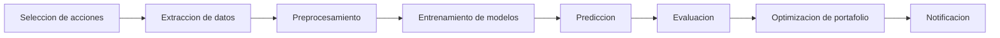
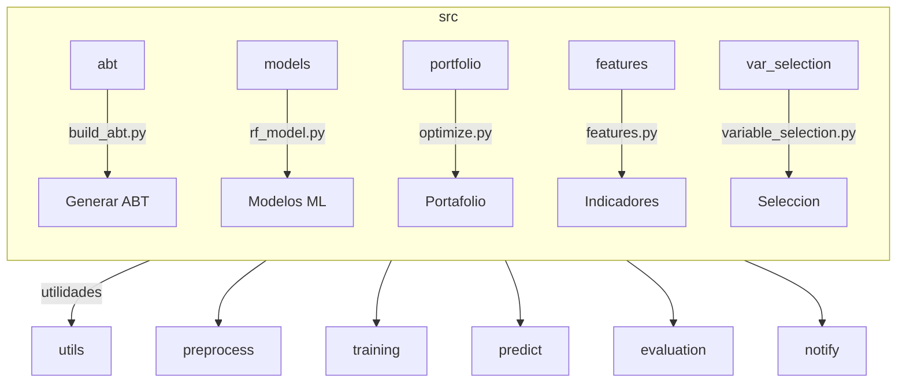
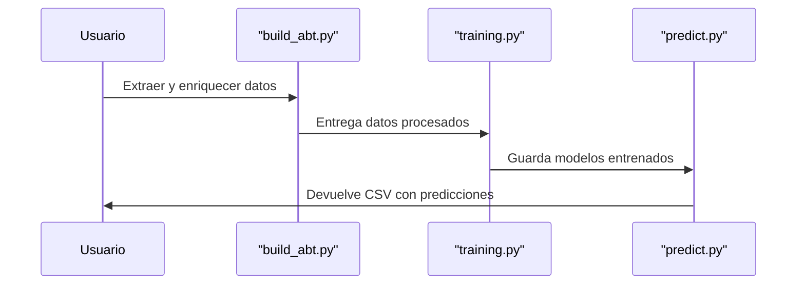
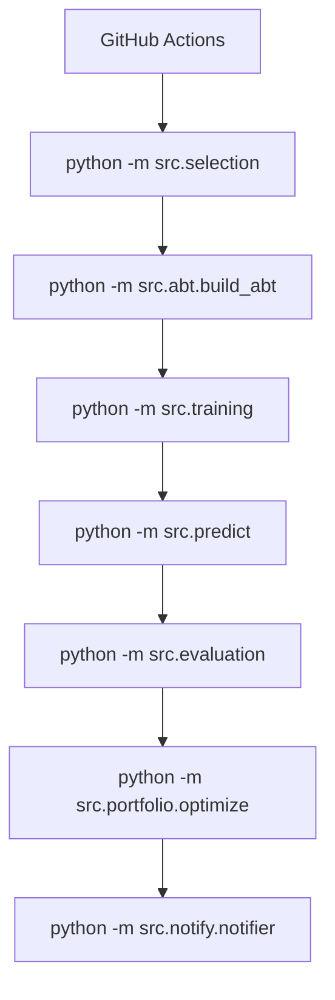
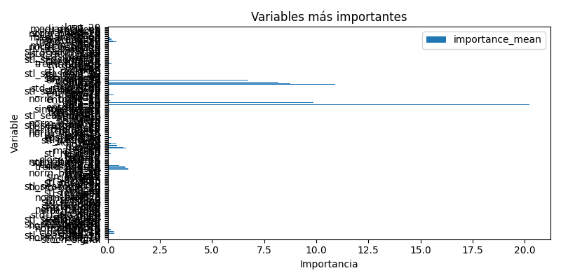

# Yahoo Finance Pipeline


¡Bienvenido a este pequeño experimento! Aquí encontrarás un pipeline educativo que procesa datos de Yahoo Finance de principio a fin. Cada fase está separada en módulos para que puedas revisarla, jugar con ella y adaptarla a tu antojo. No necesitas ser un gurú de Python; basta con seguir las instrucciones y ver qué pasa.

El recorrido va desde elegir los tickers hasta entrenar modelos y armar un portafolio. Para rematar, incluye un ejemplo de notificación final.

## Diagrama general



Puedes lanzarlo a mano o dejar que GitHub Actions lo haga por ti.

## Instalacion

1. Usa Python 3.11 o superior.
2. Instala las dependencias con:

```bash
pip install -r requirements.txt
```

## Configuracion rapida

El archivo `config.yaml` define los ETFs que se procesaran y otras opciones basicas:

```yaml
etfs:
  - SPY
  - QQQ
  - IEF
  - GLD
  - EEM
  - VNQ
start_date: "2015-01-01"
prediction_horizon: 5
risk_free_rate: 0.015
```

Modifica este archivo segun tus necesidades.
## Variables de configuracion

Estas son las claves principales de `config.yaml` y su uso:

* **etfs**: lista de fondos o indices a procesar.
* **start_date**: fecha inicial para descargar historicos.
* **prediction_horizon**: numero de dias a predecir.
* **risk_free_rate**: tasa libre de riesgo usada en la optimizacion.
* **data_dir**: carpeta donde se guardan los CSV descargados.
* **model_dir**: carpeta para los modelos entrenados.
* **evaluation_dir**: ruta donde se escriben las metricas.
* **target_cols**: columna objetivo por cada ETF.

En los flujos de GitHub Actions tambien se utilizan `GITHUB_TOKEN` o `GH_PAT`
para autorizar los commits automaticos.

## Registros y modo offline

Si una descarga falla o no tienes conexion, los scripts generan datos de ejemplo para que puedas seguir el flujo. Ademas, cada etapa escribe mensajes detallados en la consola indicando su progreso y si se activo este modo.


## Estructura de carpetas



La carpeta `src` contiene las utilidades principales. Algunos scripts son plantillas listas para que agregues tu logica.

* `abt/` crea la "Analytic Base Table" con datos diarios descargados y enriquecidos.
* `models/daily/` almacena ejemplos de modelos de machine learning y los modelos entrenados mensualmente.
  Estos archivos `.joblib`, `.json` y `.keras` se rastrean mediante **Git LFS**, por lo que conviene ejecutar `git lfs install` y `git lfs pull` tras clonar el proyecto.
* `portfolio/` ofrece herramientas para optimizacion de cartera.
* `notify/` muestra como enviar un mensaje con los resultados.
* `features.py` implementa indicadores técnicos usados en el ABT.
* `variable_selection.py` ayuda a elegir las columnas más relevantes.
* `clean_models_daily.py` y `clean_models_weekly.py` eliminan modelos
  almacenados para un reinicio rápido.

Ademas existen scripts de seleccion y prediccion en la raiz del paquete para ejecutar el flujo sin complicaciones.

## Ejecucion paso a paso

1. **Seleccion de acciones**

   ```bash
   python -m src.selection
   ```
   Verás una lista de tickers interesantes segun volumen, estabilidad y desempeño. Perfecta para empezar.

2. **Descarga y preprocesamiento**
   
  ```bash
  python -m src.abt.build_abt
  ```
  Puedes pasar `--frequency weekly` o `--frequency monthly` para obtener la ABT agregada en esas periodicidades.
  Esto baja datos historicos y agrega indicadores tecnicos. Antes de ejecutarlo puedes editar `config.yaml` para cambiar los tickers o el rango de fechas. Durante la ejecucion se imprimen las primeras filas de cada DataFrame y sus dimensiones para que puedas seguir el avance.
   La ABT final incluye ademas las nuevas variables de rezago (1, 7 y 14 dias) y las medias moviles de 13 y 26 dias del cierre.
   Tambien se agregan columnas booleanas que marcan feriados (`is_holiday`, `next_is_holiday`, `prev_is_holiday`), el dia de elecciones en EE.UU. (`is_election_day`, `next_is_election_day`) y el cierre de mes (`is_month_end`).

3. **Entrenamiento**

   ```bash
   python -m src.training
   ```

   Se generan varios modelos de ejemplo y se guardan en `models/daily/`. Actualmente
   se entrenan regresión lineal, Random Forest, XGBoost, LightGBM, LSTM y ARIMA.
  Cada entrenamiento utiliza por defecto los últimos **12 meses** de datos
   (más unos 50 días extra para calcular las medias móviles) y reserva la
   última semana como conjunto de validación. Se aplica validación
   cruzada temporal con ventanas de 60 días para predecir el día siguiente.
    Puedes ampliar la grilla de parámetros en `src/training.py` si necesitas ajustes más robustos. En pantalla
   verás un resumen de las matrices de entrenamiento usadas para cada ticker.
   Tras entrenar se calculan métricas y se guardan en la carpeta indicada por
   `evaluation_dir`. Cada archivo lleva la fecha del entrenamiento (`run_date`) y las
   métricas también se imprimen en los logs. El CSV incluye además las columnas
   `ABT Window`, `Train Window`, `Test Window` y `Predict Date` para dejar
   constancia de los rangos utilizados y la fecha que se pronostica.


4. **Prediccion**

   ```bash
   python -m src.predict
   ```
   Aplica los modelos guardados y crea `results/predicts/<fecha>_daily_predictions.csv` (o la variante semanal/mensual).
   El archivo contiene las columnas `ticker`, `model`, `actual`, `pred`, `Training Window`, `Predict moment` y `parameters`.

5. **Evaluacion**

   ```bash
   python -m src.evaluation
   ```
   Compara predicciones con valores reales y guarda metricas como MAE, MSE, RMSE, MAPE, R2 y EVS.

## Metricas de evaluacion

La funcion de evaluacion calcula los siguientes indicadores:

- **MAE**: error absoluto medio.
- **MSE**: error cuadratico medio.
- **RMSE**: raiz cuadrada del MSE.
- **MAPE**: porcentaje de error absoluto medio.
- **R2**: coeficiente de determinacion.
- **EVS**: varianza explicada por el modelo.


6. **Optimizacion de portafolio**

   ```bash
   python -m src.portfolio.optimize
   ```
   Ajusta los pesos segun tus reglas para armar un portafolio equilibrado.

7. **Notificacion**

   ```bash
   python -m src.notify.notifier --message "Proceso completo"
   ```
   Envía un aviso por correo o chat con los resultados finales.

8. **Limpieza opcional**

   ```bash
   python -m src.clean_models_daily
   python -m src.clean_models_weekly
   ```
   Elimina los modelos guardados para empezar de cero.


## Flujo de entrenamiento y prediccion



## Automatizacion

En `.github/workflows` encontraras los flujos que ejecutan el pipeline de forma programada:


* `Monthly_training_daily_prediction.yml` ejecuta el entrenamiento completo cada tres meses y guarda los modelos resultantes en la carpeta `models/daily/`. Tras entrenar se realiza un commit automatico con cualquier archivo `.joblib`, `.json` o `.keras` nuevo o actualizado para mantener la version mas reciente en el repositorio. Las métricas se escriben en `results/metrics` y las variables seleccionadas en `results/features`.
  Adicionalmente, se genera `results/trainingpreds/fullpredict.csv` con las predicciones de entrenamiento para cada modelo.
* `weekly.yml` genera la version agregada semanalmente del ABT. Se ejecuta cada lunes y sube los archivos como artefactos.
* `monthly_abt.yml` genera la version agregada mensual del ABT. Se ejecuta cada mes y sube los archivos como artefactos.
* `Monthly_training_weekly_prediction.yml` reentrena los modelos cada mes usando datos semanales y realiza un pronóstico del promedio de la siguiente semana.
* `weekly_process.yml` utiliza los modelos almacenados para predecir la próxima semana. Guarda `results/predicts/<fecha>_weekly_predictions.csv` y realiza un commit automático si hay cambios.
* `daily.yml` procesa los datos nuevos y aplica **unicamente** los modelos almacenados en `models/daily/`; no ejecuta ninguna fase de entrenamiento. Las predicciones se escriben en `results/predicts/<fecha>_daily_predictions.csv` y se suben mediante un commit automatico cuando existen cambios.


Para que estos flujos suban cambios por ti, revisa que `GITHUB_TOKEN` tenga permisos de escritura. Si trabajas en un fork, crea un *Personal Access Token* y guárdalo como `GH_PAT`. ¡Listo!

## Diagrama del pipeline automatizado



Cada bloque representa la ejecucion de un modulo. Si prefieres hacerlo manualmente, ejecuta cada comando en tu terminal siguiendo el orden del diagrama.

## Contribuciones

Este proyecto es un punto de partida. Puedes reemplazar las secciones marcadas como "placeholder" con implementaciones mas robustas. Se aceptan mejoras y comentarios.

## Validación cruzada temporal

La función `hybrid_cv_split` en `src/utils` genera índices de entrenamiento y prueba respetando una ventana fija de 90 observaciones, un `gap` de 5 días y un avance de 7 pasos entre folds. El siguiente ejemplo muestra su uso con un arreglo ficticio de 200 datos:

```python
from utils import hybrid_cv_split
import numpy as np

X = np.arange(200)
for fold, (train_idx, test_idx) in enumerate(hybrid_cv_split(X)):
    print(f"Fold {fold}: train {train_idx[0]}-{train_idx[-1]}, test {test_idx[0]}")
```

Esto produciría como máximo diez particiones desplazando la ventana a lo largo del tiempo.

## Visualizaciones diarias

Estas imágenes se generan a partir de los datos más recientes y se actualizan todos los días.



