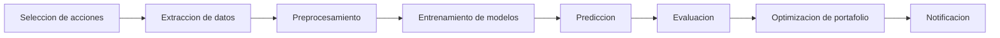
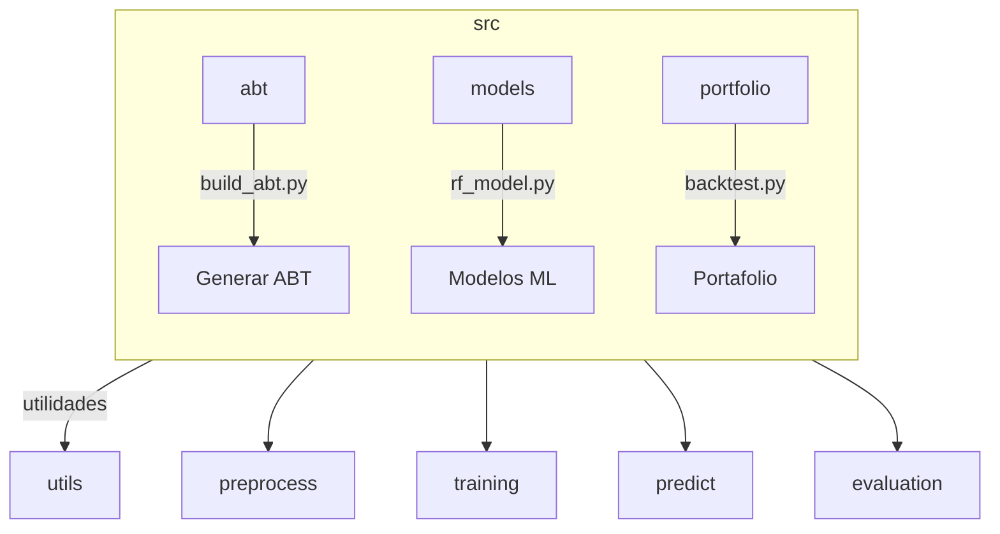
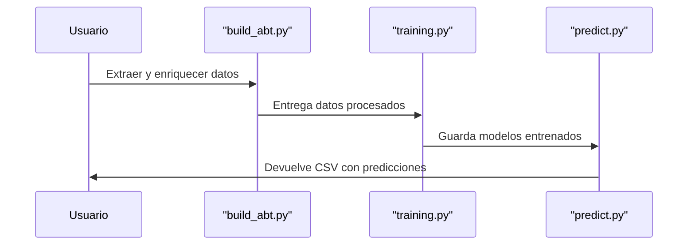
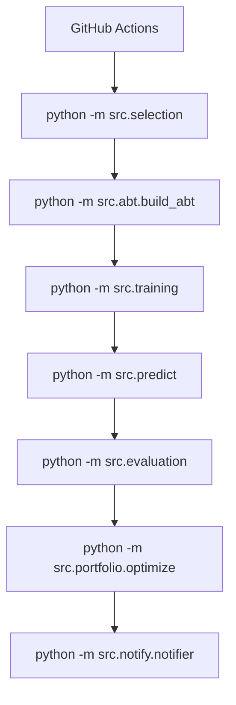

# Yahoo Finance Pipeline

Este proyecto ofrece una serie de scripts para crear un flujo de trabajo completo con datos financieros descargados de Yahoo Finance. La idea es proporcionar un ejemplo sencillo que muestre desde la descarga de datos hasta la evaluación de modelos y la generación de recomendaciones.

Aunque el código es mínimo, sirve como plantilla educativa. Cada paso se
encuentra aislado en un módulo para que puedas estudiarlo y modificarlo según
tus necesidades. No necesitas ser experto en Python; basta con seguir las
instrucciones e ir probando.

El objetivo es que puedas entender todo el recorrido: desde la selección de los
tickers, pasando por la construcción del dataset, hasta el cálculo de métricas y
la creación de un portafolio. También se incluye un ejemplo de notificación para
cerrar el ciclo completo.

## Diagrama general



Este flujo se ejecuta normalmente de forma programada mediante GitHub Actions.

## Requisitos

* Python 3.11 o superior
* Las dependencias listadas en `requirements.txt`

Instala todo con:

```bash
pip install -r requirements.txt
```

## Configuracion rapida

El archivo `config.yaml` define los ETFs que se van a procesar y otras opciones básicas:

```yaml
etfs:
  - SPY
  - QQQ
start_date: "2015-01-01"
prediction_horizon: 5
```

Cambia este archivo segun tus necesidades.

## Estructura de carpetas



La carpeta `src` contiene todas las utilidades. Algunos scripts son simples plantillas para mostrar donde agregar tu logica.

* `abt/` incluye la construcción de la "Analytic Base Table". Aquí se descargan y
  enriquecen los datos diarios.
* `models/` contiene ejemplos de modelos de machine learning listos para usar o
  para que los sustituyas por los tuyos. En esta carpeta se almacenan tambien los
  modelos entrenados mensualmente que se versionan en el repositorio.
* `portfolio/` alberga herramientas para backtesting y optimización de cartera.
* `notify/` muestra cómo enviar un correo o mensaje una vez que tienes nuevos
  resultados.

Además de estas carpetas, existen scripts de selección y predicción en la raíz
del paquete para que puedas ejecutar el flujo sin complicaciones.

## Ejecucion paso a paso

1. **Seleccion de acciones**

   Ejecuta:
   ```bash
   python -m src.selection
   ```
   Obtendras una lista de los tickers mas interesantes según volumen, estabilidad y desempeño. Esta lista se usa como punto de partida para el resto del flujo.

2. **Descarga y preprocesamiento**
   
   ```bash
   python -m src.abt.build_abt
   ```
   Esto baja datos historicos y agrega indicadores tecnicos. Antes de ejecutarlo puedes editar `config.yaml` para cambiar los tickers o el rango de fechas. Durante la ejecucion se imprimen las primeras filas de cada DataFrame y sus dimensiones para que puedas seguir el avance.

3. **Entrenamiento**
   
   ```bash
   python -m src.training
   ```
    Se generan varios modelos de ejemplo y se guardan en `models/`. Cada
    entrenamiento utiliza los últimos 6 meses de datos y aplica validación
    cruzada temporal con ventanas de 60 días para predecir el día siguiente.
    Puedes ampliar la grilla de parámetros en `src/training.py` si necesitas ajustes más robustos. En pantalla
   verás un resumen de las matrices de entrenamiento usadas para cada ticker.
   Tras entrenar se calculan métricas y se guardan en la carpeta indicada por
   `evaluation_dir`. Cada archivo lleva la fecha del entrenamiento y las
   métricas también se imprimen en los logs.

4. **Prediccion**
   
   ```bash
   python -m src.predict
   ```
   Se aplican los modelos guardados y se genera un archivo `predictions.csv` en la carpeta `results/`. El comando mostrará también un panorama del DataFrame usado para predecir.

5. **Evaluacion**
   
   ```bash
   python -m src.evaluation
   ```
   Compara predicciones con valores reales y emite varias métricas (MAE, MSE,
   RMSE, MAPE, R2 y EVS). Sirve para decidir si los modelos deben reentrenarse.

6. **Optimizacion de portafolio**
   
   ```bash
   python -m src.portfolio.optimize
   ```
   Ajusta los pesos segun tus reglas de negocio para construir un portafolio equilibrado.

7. **Notificacion**

   ```bash
   python -m src.notify.notifier --message "Proceso completo"
   ```
   Envía un aviso por correo o chat con los resultados finales. Es un ejemplo que puedes adaptar a tu sistema de mensajería.

## Flujo de entrenamiento y prediccion



## Automatizacion

El repositorio incluye flujos de trabajo en `.github/workflows` que ejecutan el pipeline de forma programada. Estos flujos se complementan de la siguiente manera:

* `monthly.yml` ejecuta el entrenamiento completo cada tres meses y guarda los modelos resultantes en la carpeta `models/`. Tras entrenar se realiza un commit automatico con cualquier archivo `*.pkl` nuevo o actualizado para mantener la version mas reciente en el repositorio.
* `weekly.yml` genera la version agregada semanalmente del ABT. Se ejecuta cada lunes y sube los archivos como artefactos.
* `daily.yml` procesa los datos nuevos y aplica **unicamente** los modelos almacenados en `models/`; no ejecuta ninguna fase de entrenamiento. Las predicciones se escriben en `results/predictions.csv` y se suben mediante un commit automatico cuando existen cambios.

Para que estos flujos puedan subir cambios al repositorio asegúrate de que el `GITHUB_TOKEN` tenga permisos de escritura. Los archivos YAML incluyen `permissions: contents: write`, con lo que el token integrado bastará en la mayoría de los repositorios. Si usas un fork o tu `GITHUB_TOKEN` es de solo lectura, crea un *Personal Access Token* y guárdalo como `GH_PAT`. Luego modifica los workflows para utilizar dicho token al hacer `git push`.

## Diagrama del pipeline automatizado

El siguiente esquema muestra cómo cada script se encadena cuando se ejecuta desde
GitHub Actions o desde tu propio entorno local:



Cada bloque representa la ejecucion de un modulo. Si prefieres hacerlo
manualmente, puedes ejecutar cada comando en tu terminal siguiendo el orden del
diagrama.

## Contribuciones

Estas utilidades son un punto de partida. Puedes reemplazar las secciones marcadas como "placeholder" con implementaciones mas robustas. Se aceptan mejoras y comentarios.

