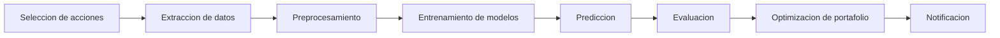
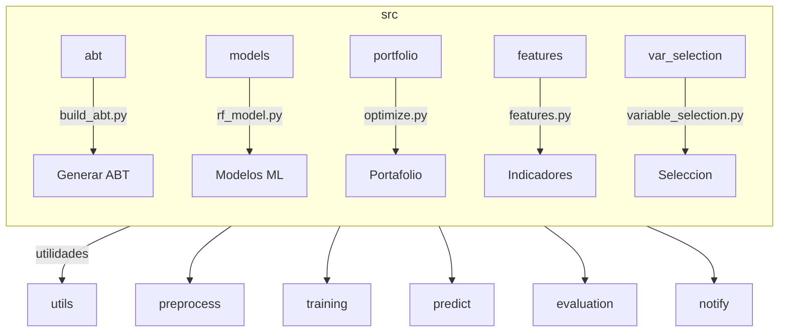
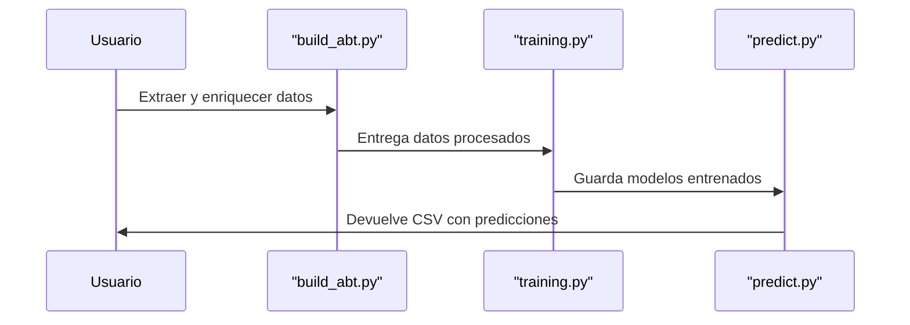
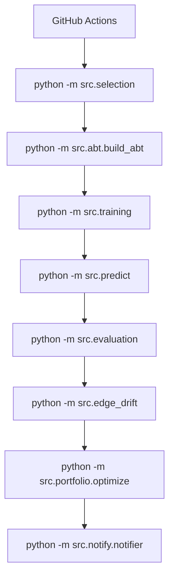
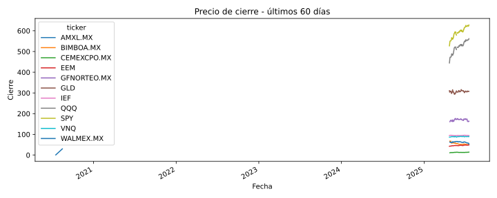
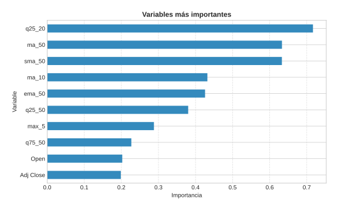

# Yahoo Finance Pipeline


Bienvenido a este proyecto experimental. Aquí encontrará un pipeline educativo que procesa datos de Yahoo Finance de principio a fin. Cada fase está organizada en módulos para facilitar su revisión y personalización. No es necesario ser un experto en Python; basta con seguir las instrucciones correspondientes.

El recorrido va desde elegir los tickers hasta entrenar modelos y armar un portafolio. Para rematar, incluye un ejemplo de notificación final. Puede consultar las gráficas y resultados en línea en <https://jcval94.github.io/yahoo/>.

## Publicar dashboard en GitHub Pages

El dashboard estático vive en `docs/` y las visualizaciones se copian a `docs/viz/` durante los workflows automáticos.

1. En **Settings → Pages**, configure **Build and deployment** en **GitHub Actions**.
2. El workflow `.github/workflows/pages.yml` despliega el contenido de `docs/` cada vez que hay cambios en esa carpeta.
3. Los workflows `daily.yml` y `dashboard.yml` ahora también hacen commit de `docs/viz/*.svg` y `docs/viz/manifest.json`, por lo que la página se actualiza con cada nueva corrida.

La URL final será: `https://<usuario>.github.io/<repositorio>/`.

## Diagrama general


```mermaid
flowchart LR
    A[Seleccion de acciones] --> B[Extraccion de datos]
    B --> C[Preprocesamiento]
    C --> D[Entrenamiento de modelos]
    D --> E[Prediccion]
    E --> F[Evaluacion]
    F --> G[Optimizacion de portafolio]
    G --> H[Notificacion]
```

Es posible ejecutarlo de forma manual o dejar que GitHub Actions lo realice de manera automática.

## Instalacion

1. Usa Python 3.11 o superior.
2. Instala las dependencias con:

```bash
pip install -r requirements.txt
```

Si desea trabajar con los artefactos de modelos versionados en Git LFS, ejecute tambien:

```bash
git lfs install
git lfs pull
```

## Inicio rapido

Para validar que todo funciona en local, puede correr el flujo minimo diario:

```bash
python -m src.abt.build_abt
python -m src.training
python -m src.predict
python -m src.evaluation
```

Al finalizar, revise:

- `results/predicts/` para las predicciones generadas.
- `results/metrics/` para las metricas de evaluacion.
- `models/daily/` para los modelos entrenados.

## Configuracion rapida

El archivo `config.yaml` define los ETFs que se procesaran y otras opciones basicas:

```yaml
etfs:
  - SPY
  - QQQ
  - IEF
  - GLD
  - EEM
  - VNQ
start_date: "2015-01-01"
prediction_horizon: 5
risk_free_rate: 0.015
```

Modifique este archivo según sus necesidades.
## Variables de configuracion

Estas son las claves principales de `config.yaml` y su uso:

* **etfs**: lista de fondos o indices a procesar.
* **start_date**: fecha inicial para descargar historicos.
* **prediction_horizon**: numero de dias a predecir.
* **risk_free_rate**: tasa libre de riesgo usada en la optimizacion.
* **data_dir**: carpeta donde se guardan los CSV descargados.
* **model_dir**: carpeta para los modelos entrenados.
* **evaluation_dir**: ruta donde se escriben las metricas.
* **target_cols**: columna objetivo por cada ETF.

En los flujos de GitHub Actions tambien se utilizan `GITHUB_TOKEN` o `GH_PAT`
para autorizar los commits automaticos.

## Registros y modo offline

Si una descarga falla o no tiene conexión, los scripts generan datos de ejemplo para que pueda seguir el flujo. Además, cada etapa escribe mensajes detallados en la consola indicando su progreso y si se activó este modo.


## Estructura de carpetas


```mermaid
flowchart TB
    subgraph src
      direction TB
      A1[abt] -- build_abt.py --> A2[Generar ABT]
      B1[models] -- rf_model.py --> B2[Modelos ML]
      C1[portfolio] -- optimize.py --> C2[Portafolio]
      D1[features] -- features.py --> D2[Indicadores]
      E1[var_selection] -- variable_selection.py --> E2[Seleccion]
    end
    src -->|utilidades| utils
    src --> preprocess
    src --> training
    src --> predict
    src --> evaluation
    src --> notify
```

La carpeta `src` contiene las utilidades principales. Algunos scripts son plantillas que puede completar con su propia lógica.

* `abt/` crea la "Analytic Base Table" con datos diarios descargados y enriquecidos.
* `models/daily/` almacena ejemplos de modelos de machine learning y los modelos entrenados mensualmente.
  Estos archivos `.joblib`, `.json` y `.keras` se rastrean mediante **Git LFS**, por lo que conviene ejecutar `git lfs install` y `git lfs pull` tras clonar el proyecto.
* `portfolio/` ofrece herramientas para optimizacion de cartera.
* `notify/` muestra como enviar un mensaje con los resultados.
* `features.py` implementa indicadores técnicos usados en el ABT.
* `variable_selection.py` ayuda a elegir las columnas más relevantes.
* `clean_models_daily.py` y `clean_models_weekly.py` eliminan modelos
  almacenados para un reinicio rápido.

Además, existen scripts de selección y predicción en la raíz del paquete que permiten ejecutar el flujo sin mayores complicaciones.

## Ejecucion paso a paso

1. **Seleccion de acciones**

   ```bash
   python -m src.selection
   ```
  Se mostrará una lista de tickers interesantes según volumen, estabilidad y desempeño. Ideal para comenzar.

2. **Descarga y preprocesamiento**
   
  ```bash
  python -m src.abt.build_abt
  ```
  Es posible pasar `--frequency weekly` o `--frequency monthly` para obtener la ABT agregada en esas periodicidades.

  **Configuracion de cola de recálculo (`safety_rows`)**
  - El ABT incremental calcula `recalc_rows` como `max(window_max + margen, min_safety_rows)`.
  - `window_max` se obtiene de las features activas (actualmente 90), por lo que no se recalcula de más cuando no hace falta.
  - En `config.yaml` puede definir:
    - `recalc.min_safety_rows`: mínimo global.
    - `recalc.safety_rows_by_frequency.daily|weekly|monthly|intraday`: override por frecuencia.
  - Regla práctica para elegir `safety_rows`:
    - **daily**: 120-220 con features estándar.
    - **weekly**: 60-140 (menos ruido y menos puntos).
    - **monthly**: 40-80 suele bastar.
    - **intraday**: 250-500 si hay alta densidad de features rolling por sesión.
  - Si aumenta el número de features de lag/rolling, incremente el mínimo para evitar diferencias entre rebuild incremental y full rebuild.
  Esto descarga datos históricos y agrega indicadores técnicos. Antes de ejecutarlo, puede editar `config.yaml` para cambiar los tickers o el rango de fechas. Durante la ejecución se imprimen las primeras filas de cada DataFrame y sus dimensiones, de modo que se pueda seguir el avance.
   La ABT final incluye ademas las nuevas variables de rezago (1, 7 y 14 dias) y las medias moviles de 13 y 26 dias del cierre.
   Tambien se agregan columnas booleanas que marcan feriados (`is_holiday`, `next_is_holiday`, `prev_is_holiday`), el dia de elecciones en EE.UU. (`is_election_day`, `next_is_election_day`) y el cierre de mes (`is_month_end`).

3. **Entrenamiento**

   ```bash
   python -m src.training
   ```

   Se generan varios modelos de ejemplo y se guardan en `models/daily/`. Actualmente
   se entrenan regresión lineal, Random Forest, XGBoost, LightGBM, LSTM y ARIMA.
  Cada entrenamiento utiliza por defecto los últimos **12 meses** de datos
   (más unos 50 días extra para calcular las medias móviles) y reserva la
   última semana como conjunto de validación. Se aplica validación
   cruzada temporal con ventanas de 60 días para predecir el día siguiente.
    Es posible ampliar la grilla de parámetros en `src/training.py` si se requieren ajustes más robustos. En pantalla
   se muestra un resumen de las matrices de entrenamiento utilizadas para cada ticker.
   Tras entrenar se calculan métricas y se guardan en la carpeta indicada por
   `evaluation_dir`. Cada archivo lleva la fecha del entrenamiento (`run_date`) y las
   métricas también se imprimen en los logs. El CSV incluye además las columnas
   `ABT Window`, `Train Window`, `Test Window` y `Predict Date` para dejar
   constancia de los rangos utilizados y la fecha que se pronostica.


4. **Prediccion**

   ```bash
   python -m src.predict
   ```
   Aplica los modelos guardados y crea `results/predicts/<fecha>_daily_predictions.csv` (o la variante semanal/mensual).
   El archivo contiene las columnas `ticker`, `model`, `actual`, `pred`, `Training Window`, `Predict moment` y `parameters`.

5. **Evaluacion**

   ```bash
   python -m src.evaluation
   ```
   Compara predicciones con valores reales y guarda metricas como MAE, MSE, RMSE, MAPE, R2 y EVS.

## Metricas de evaluacion

La funcion de evaluacion calcula los siguientes indicadores:

- **MAE**: error absoluto medio.
- **MSE**: error cuadratico medio.
- **RMSE**: raiz cuadrada del MSE.
- **MAPE**: porcentaje de error absoluto medio.
- **R2**: coeficiente de determinacion.
- **EVS**: varianza explicada por el modelo.


6. **Monitoreo de deriva**

   ```bash
   python -m src.edge_drift
   ```
   Genera un reporte con las metricas de los ultimos 15 dias de `results/edge_metrics` y calcula un puntaje de deriva.

6.1 **Monitoreo de latencia intradía**

   ```bash
   python -m src.monitoring.data_latency
   python -m src.monitoring.latency_viz
   ```
   El primer comando genera `results/latency/latency_<fecha>.csv` con una fila por ticker y las columnas:
   `download_time_utc`, `last_bar_timestamp`, `latency_minutes`, `interval_used` y `source`.
   El segundo comando consolida histórico en `results/viz/latency_monitor.csv` y produce la gráfica
   `docs/viz/latency_monitor.svg` con la latencia media y p95 por día.

   **Cómo interpretarlo**:
   - `latency_minutes` cercano a 0 indica datos prácticamente en tiempo real.
   - Un aumento sostenido del promedio sugiere retraso general del proveedor o del workflow.
   - Si el p95 crece mucho más que la media, hay degradación puntual en algunos tickers.
   - `status = no_data` indica que no hubo barras intradía disponibles para ese ticker en la corrida.

7. **Optimizacion de portafolio**

   ```bash
   python -m src.portfolio.optimize
   ```
  Ajuste los pesos según sus propias reglas para armar un portafolio equilibrado.

8. **Notificacion**

   ```bash
   python -m src.notify.notifier --message "Proceso completo"
   ```
   Envía un aviso por correo o chat con los resultados finales.

9. **Limpieza opcional**

   ```bash
   python -m src.clean_models_daily
   python -m src.clean_models_weekly
   ```
   Elimina los modelos guardados para empezar de cero.

10. **Actions (paper trading diario)**

   ```bash
   python -m src.actions.paper_trader --backtest-days 15
   ```
   Simula decisiones de compra/venta usando cinco estrategias en competencia,
   comisiones y deslizamiento. Guarda trazabilidad detallada en `results/actions/`:
   `paper_trades.csv`, `daily_activity.csv`, `open_positions.csv` y el
   backtesting de estrategias en los últimos 15 días:
   `strategy_backtest_15d_summary.csv`, `strategy_backtest_15d_daily.csv`
   y `strategy_backtest_15d_trades.csv`.


## Flujo de entrenamiento y prediccion


```mermaid
sequenceDiagram
    participant Usuario
    participant ABT as "build_abt.py"
    participant Train as "training.py"
    participant Pred as "predict.py"

    Usuario->>ABT: Extraer y enriquecer datos
    ABT->>Train: Entrega datos procesados
    Train->>Pred: Guarda modelos entrenados
    Pred->>Usuario: Devuelve CSV con predicciones
```

## Automatizacion

En `.github/workflows` encontraras los flujos que ejecutan el pipeline de forma programada:


* `Monthly_training_daily_prediction.yml` ejecuta el entrenamiento completo cada tres meses y guarda los modelos resultantes en la carpeta `models/daily/`. Tras entrenar se realiza un commit automatico con cualquier archivo `.joblib`, `.json` o `.keras` nuevo o actualizado para mantener la version mas reciente en el repositorio. Las métricas se escriben en `results/metrics` y las variables seleccionadas en `results/features`.
  Adicionalmente, se genera `results/trainingpreds/fullpredict.csv` con las predicciones de entrenamiento para cada modelo.
* `weekly.yml` genera la version agregada semanalmente del ABT. Se ejecuta cada lunes y sube los archivos como artefactos.
* `monthly_abt.yml` genera la version agregada mensual del ABT. Se ejecuta cada mes y sube los archivos como artefactos.
* `Monthly_training_weekly_prediction.yml` reentrena los modelos cada mes usando datos semanales y realiza un pronóstico del promedio de la siguiente semana.
* `weekly_process.yml` utiliza los modelos almacenados para predecir la próxima semana. Guarda `results/predicts/<fecha>_weekly_predictions.csv` y realiza un commit automático si hay cambios.
* `daily.yml` procesa los datos nuevos y aplica **unicamente** los modelos almacenados en `models/daily/`; no ejecuta ninguna fase de entrenamiento. Las predicciones se escriben en `results/predicts/<fecha>_daily_predictions.csv`. Luego ejecuta `src.edge_drift` para evaluar la deriva y guarda un CSV en `results/drift/edge_drift_evaluation_<fecha>.csv` que también se sube mediante un commit automático cuando existen cambios.

* `actions.yml` ejecuta el módulo de **paper trading** una vez al día entre semana.
  El flujo genera predicciones diarias y después corre `src.actions.paper_trader`,
  guardando operaciones simuladas con PnL, comisiones y estado de posiciones en
  `results/actions/*.csv`.


Para que estos flujos suban cambios por usted, asegúrese de que `GITHUB_TOKEN` cuente con permisos de escritura. Si trabaja en un fork, cree un *Personal Access Token* y guárdelo como `GH_PAT`. Listo.

## Diagrama del pipeline automatizado


```mermaid
flowchart TD
    GA[GitHub Actions] --> S[python -m src.selection]
    S --> ABT[python -m src.abt.build_abt]
    ABT --> TR[python -m src.training]
    TR --> PR[python -m src.predict]
    PR --> EV[python -m src.evaluation]
    EV --> DR[python -m src.edge_drift]
    DR --> OP[python -m src.portfolio.optimize]
    OP --> NT[python -m src.notify.notifier]
```

Cada bloque representa la ejecución de un módulo. Si prefiere realizarlo de manera manual, ejecute cada comando en su terminal siguiendo el orden del diagrama.

## Contribuciones

Este proyecto es un punto de partida. Puede reemplazar las secciones marcadas como "placeholder" con implementaciones más robustas. Se aceptan mejoras y comentarios.

## Validación cruzada temporal

La función `hybrid_cv_split` en `src/utils` genera índices de entrenamiento y prueba respetando una ventana fija de 90 observaciones, un `gap` de 5 días y un avance de 7 pasos entre folds. El siguiente ejemplo muestra su uso con un arreglo ficticio de 200 datos:

```python
from utils import hybrid_cv_split
import numpy as np

X = np.arange(200)
for fold, (train_idx, test_idx) in enumerate(hybrid_cv_split(X)):
    print(f"Fold {fold}: train {train_idx[0]}-{train_idx[-1]}, test {test_idx[0]}")
```

Esto produciría como máximo diez particiones desplazando la ventana a lo largo del tiempo.

## Visualizaciones diarias

Estas imágenes se generan a partir de los datos más recientes y se actualizan de forma automática.
El flujo de trabajo guarda copias en formato SVG dentro de la carpeta correspondiente.
Si el paquete `pandas` no está instalado, `src.visualization` sólo creará
archivos de marcador de posición. Asegúrate de ejecutar
`pip install -r requirements.txt` antes de generar las gráficas para que los
archivos de `results/viz/` se actualicen correctamente.





## Sitio en línea

Las gráficas generadas por el proyecto pueden consultarse en: <https://jcval94.github.io/yahoo/>
